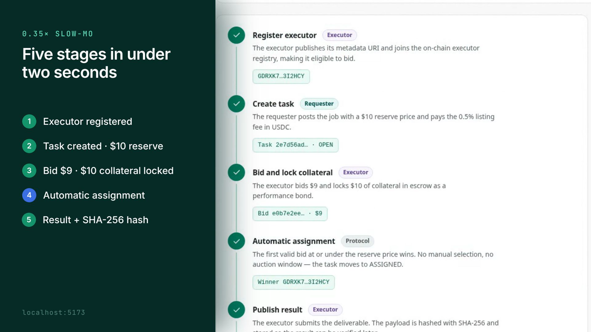
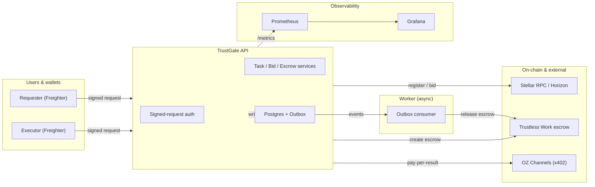
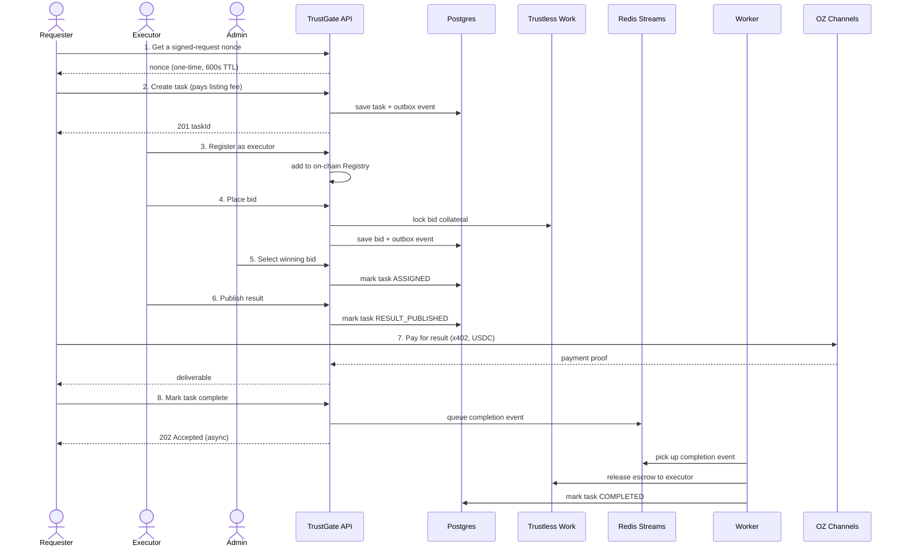
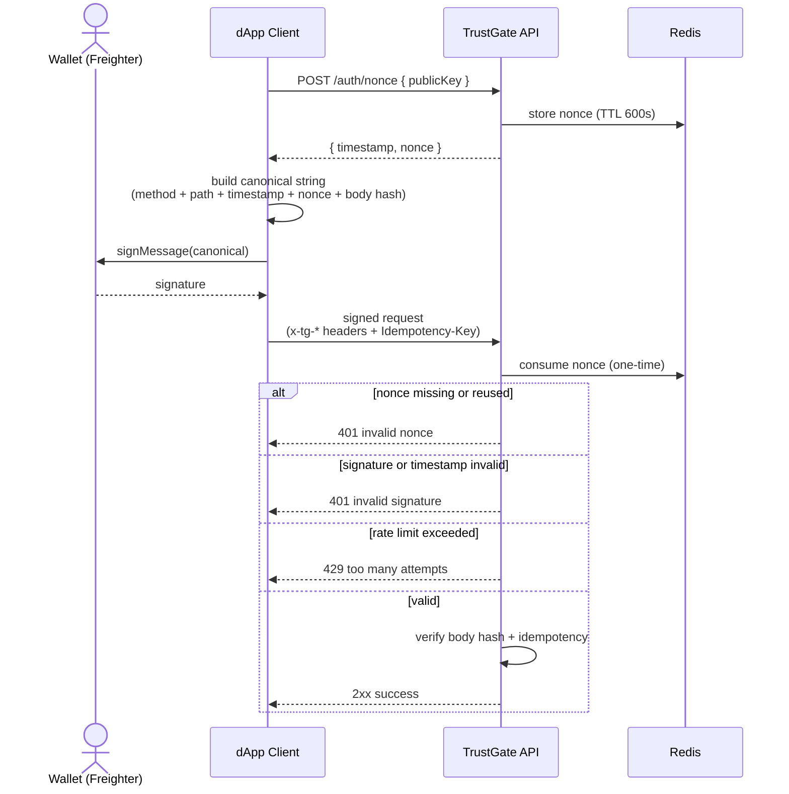

# TrustGate

**A trustless task marketplace on Stellar.** A requester posts a task and
escrows payment. Executors bid with their own collateral on the line. The
marketplace picks a winner, and Soroban + escrow settle the deal automatically
— no middleman ever holds the funds.

Highlights:

- **On-chain executor registry** — only allow-listed executors (via a Soroban
  `Registry` contract) can win bids.
- **Bid collateral** — executors stake funds via Trustless Work to deter fraud.
- **Pay-per-result** — requesters pay in USDC (x402 + MPP) only when they
  fetch the actual deliverable.
- **Async by design** — an Outbox + Redis Streams + Worker pipeline runs every
  external side-effect asynchronously, with idempotent handlers so nothing
  double-fires.
- **Signed, keyless requests** — no secret keys ever travel over the wire;
  every state-changing call is authenticated with a wallet signature and a
  one-time server nonce.
- **Observability built in** — Prometheus metrics, Grafana dashboards, alert
  rules, runbooks, and a one-command
  [baseline verifier](#observability-baseline-verification) that catches
  regressions before they ship.

```text
requester ──list task, pay fee──▶  marketplace  ◀──register, bid + collateral── executor
                                        │
                                  select winner
                                        │
                          escrow releases on completion
```

## Demo

One real run of the full lifecycle — executor registration, task creation, bid
with collateral, automatic assignment, result publication, and escrow
settlement — recorded against the live API (27s, no narration):

<video src="docs/media/trustgate-demo.mp4" poster="docs/media/trustgate-demo-poster.png" controls muted width="100%"></video>

[](docs/media/trustgate-demo.mp4)

Every number on screen comes from that run: 6/6 stages, 38.3s from executor
registration to settled escrow, $10 reserve, $9 winning bid, $10 collateral.
The stage burst is slowed to 0.35x and the 36s settlement wait is compressed
10x — both labelled on screen. The throwaway secret keys the run prints are
blurred in the recording.

The video is built with Remotion in [`demo-video/`](demo-video/README.md), which
also holds the capture script if you want to re-record it against your own
instance.

## Table of contents

- [Demo](#demo)
- [Stack](#stack)
- [Architecture](#architecture)
  - [System diagram](#system-diagram)
  - [Full lifecycle sequence](#full-lifecycle-sequence)
  - [Worker & Outbox pattern](#worker--outbox-pattern)
  - [Signed request flow](#signed-request-flow-on-testnetpubnet)
- [Quick start](#quick-start-local-network)
- [Environment variables](#environment-variables)
- [Testing](#testing)
- [Docker (full stack)](#docker-full-stack)
- [Running against real Stellar testnet](#running-against-real-stellar-testnet)
- [Signed requests (dApp)](#signed-requests-dapp)
- [API walkthrough](#example-full-lifecycle-via-curl)
- [Observability](#observability)
- [Architecture Decision Records](#architecture-decision-records)
- [Glossary](#glossary)
- [Known limitations](#known-limitations)

## Stack

| Layer | Choice |
|-------|--------|
| Runtime | Node.js 20+, TypeScript, Express |
| On-chain | Soroban `Registry` contract (executor allow-list), `@stellar/stellar-sdk` |
| Database | PostgreSQL (tasks / bids / outbox / event consumptions) |
| Queue / Streams | Redis 7+ (Redis Streams with consumer groups + XAUTOCLAIM) |
| Escrow | Trustless Work (bid collateral + milestone release) |
| Pay-per-result | x402 (`@x402/*`) + MPP (Stellar multi-path payments) |
| Auth (testnet/pubnet) | Ed25519 signed headers + server nonces (one-time, Redis 600s TTL) |
| Tests | Jest + Supertest (unit / integration / e2e) |
| Observability | pino (structured logs), prom-client (metrics), Prometheus, Grafana |
| API docs | swagger-jsdoc + swagger-ui-express → `GET /api-docs` |

## Architecture

TrustGate is split across three trust boundaries: the **dApp / wallet** in the
user's browser, the **off-chain API + Worker** we operate, and **on-chain /
external services** (Soroban RPC, Trustless Work, OZ Channels). Anything that
needs consensus lives on-chain or in Trustless Work; everything else lives in
Postgres and is mirrored to Redis Streams for async processing.

> Looking for every component and data path? See the
> [full architecture deep dive](docs/architecture.md).

### System diagram



### Full lifecycle sequence

This maps directly to the [curl walkthrough](#example-full-lifecycle-via-curl)
below — each numbered step here is the same numbered `curl` call there.



**Key guarantees:**

- Anything that crosses a trust boundary (escrow release, webhooks, listing
  fee) is **queued through the Outbox** before the HTTP transaction commits —
  it can't be lost even if the process crashes right after responding.
- The Worker delivers **at-least-once**; the `event_consumptions` table turns
  that into effectively **exactly-once per handler**, by skipping any
  `(handler_name, event_id)` pair it's already processed.
- `POST /tasks/:id/complete` returns `202 Accepted` immediately instead of
  making the requester wait on escrow/network calls.

### Worker & Outbox pattern

In short: the API writes to Postgres and to an outbox table in the same
transaction, a publisher relays outbox rows onto a Redis Stream, and the
Worker consumes that stream with automatic recovery (`XAUTOCLAIM`) and
per-handler idempotency. The full step-by-step — including tick intervals,
backlog sampling, and the metrics it emits — lives in
[docs/architecture.md](docs/architecture.md#worker--outbox-pattern-full-detail)
and [ADR 0001](docs/adr/0001-outbox-worker-idempotency.md).

### Signed request flow (on testnet/pubnet)



Server rate limits: **10 failed auth attempts/min per public key**,
**30 failed/min per IP**. After the threshold, even legitimate retries get
429'd for the rest of the sliding window — see
[P1: Security / abuse](docs/observability.md#L375-L411) in the runbook.

## Quick start (local network)

```bash
npm install
docker compose up -d          # Stellar Quickstart (standalone network) + Redis + Postgres
npm run deploy:registry       # deploys Registry contract, writes REGISTRY_CONTRACT_ID to .env
npm run start:dev             # http://localhost:3000
```

`deploy:registry` also generates and Friendbot-funds a throwaway
`ADMIN_SECRET` if you don't have one yet. Want explicit control instead? Copy
`.env.example` to `.env` and fill in values before running the steps above.

Once it's up:

| Endpoint | What it's for |
|----------|---------------|
| `GET /health` | Liveness check (`{ status: "ok" }`) |
| `GET /health/detailed` | Real Stellar RPC + Redis + Postgres connectivity check |
| `GET /metrics` | Prometheus metrics (text format) |
| `GET /api-docs` | Swagger UI — every endpoint documented and testable |
| `POST /auth/nonce` | Server-issued one-time nonce for signed requests |
| `POST /auth/signed-smoke` | Freighter / signed-request smoke test route |

## Environment variables

The full list with inline comments lives in [.env.example](.env.example), and
a ready-made testnet config lives in [.env.testnet](.env.testnet) (see the
[testnet section](#running-against-real-stellar-testnet)). Everything below
is what you actually need to get running; anything not listed here has a safe
default and is documented inline in `.env.example`.

| Variable | Required | Default | Description |
|----------|----------|---------|-------------|
| `NETWORK` | | `local` | `local` (standalone Quickstart), `testnet`, or `pubnet`. |
| `MOCK_EXTERNALS` | | `false` | Set `true` in local/dev to stub Trustless Work, x402, and webhooks so the full lifecycle works without real credentials. |
| `NODE_ENV` | | — | `development`, `test`, or `production`. |
| `STELLAR_RPC_URL` | | Quickstart local | Soroban RPC endpoint. |
| `STELLAR_HORIZON_URL` | | Quickstart local | Horizon endpoint. |
| `ADMIN_SECRET` | | auto on `local` | Marketplace admin's Stellar secret key (`S…`). Auto-generated + Friendbot-funded on `local` if unset. |
| `USDC_ISSUER` | ✅ | — | Classic USDC asset issuer (`G…`). The app derives the SAC contract ID from this + `NETWORK`. |
| `REGISTRY_CONTRACT_ID` | ✅ | — | Set by `npm run deploy:registry`. |
| `DATABASE_URL` | ✅ | | Postgres connection string. |
| `REDIS_URL` | ✅ | | Redis 7+ URL — nonces, streams, rate limits, backlog sampling. |
| `WORKER_ENABLED` | | `true` | Set `false` to disable the in-process Worker (e.g. when running it as a separate process). |
| `WORKER_POLL_MS` | | `2000` | Interval between worker ticks. |
| `MPP_SECRET_KEY` | ✅ on testnet/pubnet | | HMAC ≥ 32 bytes, binds `POST /tasks` charge challenges to their contents. Unused on `local`. |
| `TRUSTLESS_WORK_API_KEY` | ✅ (unless `MOCK_EXTERNALS`) | | API key for bid-collateral escrow + milestone releases. |
| `OZ_API_KEY` | required for the result route | | OZ Channels key. Without it, `GET /executor/tasks/:id/result` simply isn't mounted — the rest of the app still runs. |
| `EXECUTOR_WALLET` | | marketplace wallet | Stellar public key that receives x402 result payments. |
| `EXECUTOR_RESULT_PRICE` | | `$0.05` | Price for `GET /executor/tasks/:id/result`. |
| `RESULT_PUBLISHED_WEBHOOK_URL` | | — | Optional URL called with POST JSON when an executor publishes a result. |
| `TRUST_PROXY_HOPS` | | `0` | Number of trusted proxies (CDN / load balancer) in front of the app. **Must be ≥ 1 behind a proxy in production**, or the rate-limiter and request logger read the wrong client IP. |
| `ESCROW_IMPLEMENTATION` | | `trustlesswork` | Bid-collateral provider: `trustlesswork` (default, SaaS), `mock` (CI/unit tests), or `ourown` (not production-ready yet — see [ADR 0002](docs/adr/0002-on-chain-strategy-registry-immutable-escrow-saas.md) before touching this). |
| `PAUSE_NEW_TASKS` / `PAUSE_NEW_BIDS` / `PAUSE_WORKER_CONSUMPTION` | | `false` | Incident-response kill switches — see [.env.example](.env.example) for exact behavior of each. |
| `EXECUTOR_DENYLIST` | | (empty) | Comma-separated Stellar `G...` addresses to block from bidding/completing. |

### Webhook receiver (local)

For quick local testing, run a simple webhook receiver:

```bash
npm run webhook:receiver
```

Then point the app to it (for `start:dev` outside Docker):

```bash
RESULT_PUBLISHED_WEBHOOK_URL=http://localhost:4000/webhooks/result-published npm run start:dev
```

## Testing

```bash
npm test              # unit + integration (skips anything needing real external credentials)
npm run test:e2e      # full mocked lifecycle: register → publish → bid → select → pay → release
```

Tests that need real infrastructure (a live local Stellar Quickstart, a real
Trustless Work key, a real OZ Channels key) are gated with `describe.skip` and
skip cleanly when that infrastructure isn't present — they aren't flaky,
they're honest about what they need.

### Live external tests (skipped by default)

As of the current version, `npm test` reports **11 skipped tests across 2
suites** (≈9% of the suite), all gated purely by missing external credentials
or services — **no internal logic is skipped**. The remaining 111 tests /
31 suites cover internal logic with mocks.

| # | Skipped suite | Needs |
|---|---|---|
| 1 | `src/integration/sorobanRegistry.test.ts` | A live Stellar Quickstart node + `REGISTRY_CONTRACT_ID` + a funded admin keypair. |
| 2 | `src/integration/trustlessWorkEscrow.test.ts` | A valid `TRUSTLESS_WORK_API_KEY` + egress to `blocks.trustlesswork.com`. |
| 3 | `src/integration/stellarSacWithdraw.test.ts` | A running RPC node + `USDC_ASSET_CONTRACT_ID` + a funded test keypair. |
| 4 | `src/integration/ozChannelsFacilitator.test.ts` | A valid `OZ_API_KEY` + egress to the OpenZeppelin Channels API. |

To re-enable one: flip its `describe.skip` to `describe`, set
`MOCK_EXTERNALS=false`, and provide the credentials above.

> **CI-safe default**: leave all skips as-is. The observability baseline
> (below) already covers signed-request + metrics behavior, and the 111
> internal tests cover every business-logic path with mocks. Run the live
> suites manually in staging before a mainnet deploy.

## Docker (full stack)

```bash
docker compose -f docker-compose.yml -f docker-compose.observability.yml up --build -d
curl http://localhost:3000/health
```

Open:

- App + API docs: <http://localhost:3000/api-docs>
- Prometheus targets: <http://localhost:9090/targets>
- Grafana dashboards (anonymous Viewer): <http://localhost:3001/dashboards>

The `app` service waits for Stellar, Postgres, and Redis to be reachable
before starting, reads secrets from `.env.docker`, and points network URLs at
the in-Compose-network hostnames.

## Running against real Stellar testnet

```bash
npm run testnet:setup            # generates + Friendbot-funds admin/requester/executor accounts,
                                  # adds real Circle USDC trustlines, writes .env.testnet
npm run testnet:deploy-registry  # deploys the Registry contract to testnet
```

The one step that can't be scripted: fund the requester with real (fictitious)
testnet USDC via the [Circle faucet](https://faucet.circle.com) — it's a
captcha-gated web form. The setup script prints the exact address to paste in.

For signed-request validation against the real stack, run
`scripts/validate-signed-requests.ts` (uses `NETWORK=testnet`) or the
observability baseline's built-in [signed smoke](#observability-baseline-verification)
check.

## Signed requests (dApp)

On testnet/pubnet, state-changing endpoints never accept secret keys (`S…`).
Instead, the caller proves ownership of a Stellar account by signing a
canonical payload and sending it in request headers. See the
[Signed request flow](#signed-request-flow-on-testnetpubnet) diagram above for
the full sequence; this project recommends server-issued one-time nonces via
`POST /auth/nonce`, signed via Stellar Wallets Kit.

**One rule that matters more than the rest:** you must send the *exact same
bytes* you signed. The server hashes the raw request body before parsing it,
so if you build the canonical string from `JSON.stringify(body)` locally, send
that same string as the HTTP body too — same whitespace, same key order, no
`replacer`. `scripts/validate-signed-requests.ts` (via `@stellar/stellar-sdk`)
already does this correctly and is worth copying from.

### Install (React/Next.js)

```bash
npm i @creit.tech/stellar-wallets-kit @stellar/stellar-sdk
```

### Snippet

```ts
import { StellarWalletsKit, WalletNetwork, allowAllModules, FREIGHTER_ID } from '@creit.tech/stellar-wallets-kit';
import { Networks } from '@stellar/stellar-sdk';

const API_BASE_URL = 'http://localhost:3000';

const kit = new StellarWalletsKit({
  network: WalletNetwork.TESTNET,
  selectedWalletId: FREIGHTER_ID,
  modules: allowAllModules(),
});

async function sha256Hex(text: string): Promise<string> {
  const bytes = new TextEncoder().encode(text);
  const digest = await crypto.subtle.digest('SHA-256', bytes);
  return [...new Uint8Array(digest)].map((b) => b.toString(16).padStart(2, '0')).join('');
}

async function tgSignedFetch<TResponse>(
  method: 'GET' | 'POST' | 'PUT' | 'PATCH' | 'DELETE',
  path: string,
  body: unknown,
  options: { idempotencyKey?: string } = {},
): Promise<TResponse> {
  const { address: publicKey } = await kit.getAddress();

  const nonceRes = await fetch(`${API_BASE_URL}/auth/nonce`, {
    method: 'POST',
    headers: { 'Content-Type': 'application/json' },
    body: JSON.stringify({ publicKey }),
  });
  if (!nonceRes.ok) {
    throw new Error(`nonce failed: ${nonceRes.status}`);
  }
  const { timestamp, nonce } = (await nonceRes.json()) as { timestamp: number; nonce: string };

  const bodyText = JSON.stringify(body ?? {});
  const bodyHash = await sha256Hex(bodyText);

  const canonical = `${method}\n${path}\n${String(timestamp)}\n${nonce}\n${bodyHash}`;
  const { signedMessage } = await kit.signMessage(canonical, {
    address: publicKey,
    networkPassphrase: Networks.TESTNET,
  });

  const headers: Record<string, string> = {
    'Content-Type': 'application/json',
    'x-tg-public-key': publicKey,
    'x-tg-timestamp': String(timestamp),
    'x-tg-nonce': nonce,
    'x-tg-signature': signedMessage,
  };
  if (options.idempotencyKey) {
    headers['Idempotency-Key'] = options.idempotencyKey;
  }

  const res = await fetch(`${API_BASE_URL}${path}`, {
    method,
    headers,
    body: method === 'GET' ? undefined : bodyText,
  });
  if (!res.ok) {
    throw new Error(`request failed: ${res.status} ${await res.text()}`);
  }
  return (await res.json()) as TResponse;
}

async function exampleRegisterExecutor(): Promise<void> {
  await tgSignedFetch('POST', '/executors/register', { publicKey: 'G...', metadataUri: 'https://example.com/meta.json' }, {
    idempotencyKey: crypto.randomUUID(),
  });
}
```

Notes:

- The signed `path` must match the server route exactly and **exclude query
  strings** (e.g. `/tasks/123/complete`).
- `Idempotency-Key` is **required** for any state-mutating call.
- Always hash and send the *same* `bodyText` string — never re-serialize it
  between signing and sending.
- To use a different wallet, pass a different `*_ID` to the kit, or use its
  built-in modal and call `kit.setWallet(...)` before `getAddress()`.

### Freighter smoke test (local/Docker)

To validate Freighter signing against a running local stack, use the built-in
route `POST /auth/signed-smoke` — it follows the exact same
[`tgSignedFetch` pattern](#snippet) above, just against a route that always
succeeds and echoes `{ ok: true, publicKey }`. It also runs automatically as
part of the [baseline verifier](#observability-baseline-verification).

Before trying it:

- Install the Freighter browser extension and create/import an account.
- Make sure Freighter is unlocked and the account is active.
- Allow the dApp's origin in Freighter when prompted.
- If running the API via Docker, call the host URL (`http://localhost:3000`),
  not the in-compose hostname.

```bash
docker compose -f docker-compose.yml -f docker-compose.observability.yml up --build -d
```

Then from your React app, call `POST /auth/nonce` to get `{ timestamp, nonce }`,
sign the canonical string the same way as [the snippet above](#snippet), and
`POST` it to `/auth/signed-smoke` with a body like
`{ publicKey: "...", hello: "world" }`. Expected response:

```json
{ "ok": true, "publicKey": "G..." }
```

### Troubleshooting (Freighter / signed requests)

- **401 `missing signature headers`**: send all four:
  `x-tg-public-key`, `x-tg-timestamp`, `x-tg-nonce`, `x-tg-signature`.
- **401 `timestamp outside allowed window`**: call `POST /auth/nonce`
  immediately before the signed request and reuse its returned `timestamp` —
  don't use your own clock.
- **401 `invalid nonce`**: nonces are one-time. Never reuse a
  `{ nonce, timestamp }` pair; fetch a fresh one per request.
- **401 `public key mismatch for <field>`**: the body field (e.g.
  `publicKey`) must equal `x-tg-public-key`.
- **401 `invalid signature`**: double-check the canonical string is exactly
  `${METHOD}\n${PATH}\n${TIMESTAMP}\n${NONCE}\n${SHA256_HEX(bodyText)}`, that
  `PATH` excludes the query string, and that `bodyText` is the exact string
  you send in `fetch`.
- **429 `rate limit exceeded`**: too many failed auth attempts. Wait a minute,
  or fix the canonical string/payload first.
- **CORS / preflight issues**: make sure your proxy allows the `x-tg-*`
  headers.

## Example: full lifecycle via curl

The sequence diagram in [Full lifecycle sequence](#full-lifecycle-sequence)
maps to these concrete calls. On `NETWORK=local` you can use the secret-key
shortcuts below (no signed-auth middleware runs for `local`); on
`testnet`/`pubnet`, wrap each state-mutating call with the
[tgSignedFetch helper](#snippet) above instead.

```bash
# 1. Register an executor
curl -X POST localhost:3000/executors/register \
  -H 'Content-Type: application/json' \
  -d '{"secret":"S...(executor)","metadataUri":"https://executor.example.com/meta.json"}'

# 2. Requester publishes a task (pays a 0.5% USDC listing fee via MPP)
curl -X POST localhost:3000/tasks \
  -H 'Content-Type: application/json' \
  -d '{"requester":"G...","secret":"S...(requester)","reservePrice":"10","description":"Summarize this PDF","deadline":"2026-12-31T00:00:00.000Z"}'

# 3. Executor bids, locking collateral in Trustless Work escrow
curl -X POST localhost:3000/bids \
  -H 'Content-Type: application/json' \
  -d '{"taskId":"<id>","executor":"G...","secret":"S...(executor)","amount":"9","collateral":"1"}'

# 4. Admin selects the winning bid
curl -X POST localhost:3000/tasks/<id>/select -H 'x-admin-secret: <ADMIN_SECRET>'

# 5. Requester pays the executor's result endpoint via x402 (see src/services/x402PaymentService.ts)

# 6. Requester marks the task complete — returns 202 Accepted, escrow releases async via Worker
curl -X POST localhost:3000/tasks/<id>/complete \
  -H 'Content-Type: application/json' \
  -H 'Idempotency-Key: <uuid>' \
  -d '{"requester":"G...","secret":"S...(requester)"}'
```

Every request/response shape is documented interactively at `GET /api-docs`.

## Observability

- **Runbooks, SLOs, thresholds, P0/P1 triage** — all live in
  [docs/observability.md](docs/observability.md).
- **Metric catalogs**
  ([auth](src/config/authMetrics.ts),
  [worker+backlog](src/config/workerMetrics.ts))
  are the source of truth for label names and PromQL used in dashboards and
  alerts.
- **Alert rules** — [prom/alerts/trustgate-alerts.yml](prom/alerts/trustgate-alerts.yml)
  (two groups: `trustgate-auth`, `trustgate-worker`).
- **Grafana dashboards** — provisioned from
  [grafana/dashboards/](grafana/dashboards/):
  `trustgate-auth-overview.json`, `trustgate-worker-overview.json`.
- **Local observability stack** — `docker-compose.observability.yml`
  provisions Prometheus + scrape configs + rules and Grafana (anonymous
  Viewer, file-based dashboards).

## Observability baseline verification

One script proves the whole observability surface — Prometheus rules, Grafana
dashboards, signed-request auth, required metrics — works end-to-end, so
regressions get caught locally instead of in production.

```bash
bash scripts/observability-baseline.sh          # full run, tears itself down after
bash scripts/observability-baseline.sh --keep   # leave the stack up afterwards to poke around
scripts/observability-baseline.sh --help        # flags + env-var overrides
```

It runs 6 phases, aborting immediately on the first failure:

1. **Preflight parse** — lints `prom/alerts/trustgate-alerts.yml` and every
   `grafana/dashboards/*.json` (titles present, every panel has a PromQL `expr`).
2. **Stack up** — spins up the full Docker Compose stack in an isolated
   project name, so parallel runs never clash.
3. **Health wait** — polls the app, Prometheus, and Grafana health endpoints.
4. **TypeScript checks** — runs a real signed-request smoke test, checks all
   required metric names are present on `/metrics`, confirms Prometheus sees
   the app as a healthy target with the right alert groups loaded, and checks
   Grafana reports its database as healthy.
5. **Curl sanity** — double-checks the Prometheus rules API directly.
6. **Cleanup** — always tears the stack down, success or failure (unless you
   passed `--keep`).

Prefer a lighter check without a full Docker stack? `scripts/baseline-selftest.ts`
validates just the signed-request middleware and metrics payload against a
throwaway Redis container:

```bash
npx ts-node --transpile-only scripts/baseline-selftest.ts
# -> { "ok": true }
```

## Architecture Decision Records

Design choices that are non-obvious or easy to second-guess are captured as
ADRs under [docs/adr/](docs/adr/). When proposing a change to one of these
systems, open a new ADR and reference it in your PR description.

| ID | Title | Status |
|----|-------|--------|
| 0001 | [Outbox + idempotent Worker (Redis Streams) and asynchronous completion with Trustless Work](docs/adr/0001-outbox-worker-idempotency.md) | ✅ Accepted 2026-08-04 |
| 0002 | [On-chain strategy: Registry Soroban Immutable + Escrow via Trustless Work SaaS](docs/adr/0002-on-chain-strategy-registry-immutable-escrow-saas.md) | ✅ Accepted 2026-08-05 |

To add a new ADR, copy `0001-*.md` as `0003-*.md`, fill in the
`Context / Decision / Consequences / Alternatives considered` sections, and
reference it from this table.

## Glossary

| Term | Meaning in TrustGate |
|------|----------------------|
| **Nonce** | Server-issued UUID, stored in Redis with 600s TTL, consumed with `GETDEL` (one-time). Guards against replay attacks. |
| **Canonical string** | `METHOD\nPATH\nTIMESTAMP\nNONCE\nSHA256_HEX(bodyText)` — the exact bytes signed by the wallet. |
| **Outbox** | Postgres table `outbox_events`, written in the same transaction as business state. Guarantees "event published if and only if state changed." |
| **Redis Streams / PEL** | Pending Entries List: entries delivered to a consumer group but not yet `XACK`ed. `XPENDING` + `XAUTOCLAIM` recover crashed consumers. |
| **`event_consumptions`** | Postgres table keyed by `(handler_name, event_id)`. Turns at-least-once worker delivery into effectively exactly-once per handler. |
| **SAC** | Stellar Asset Contract — the Soroban contract ID derived automatically from a classic asset's `{ issuer, code }`. Used for USDC here. |
| **MPP** | Multi-Path Payments — how the marketplace charges listing fees in USDC atomically (challenge-then-settle, via `MPP_SECRET_KEY` on testnet/pubnet). |
| **x402** | HTTP 402 Payment Required standard — OZ Channels mediate the micro-USDC charge for `GET /executor/tasks/:id/result`. |
| **Stroop** | Smallest unit of a Stellar asset (1 USDC = 10,000,000 stroops). All on-wire `BIGINT` amounts in Postgres/Redis are stroops. |
| **Registry** | Soroban contract acting as the executor allow-list; only addresses added here can win bids. |

## Known limitations

A few integrations depend on external services we can't fully provision in an
automated environment. Each is wired with real, working client code — the
limitation is credentials, not implementation:

- **Trustless Work** (`EscrowService`) needs a real account/API key from
  [trustlesswork.com](https://blocks.trustlesswork.com). Use
  `MOCK_EXTERNALS=true` in local/dev to exercise the lifecycle without one.
- **OZ Channels** (x402 facilitator) needs a real key from
  [channels.openzeppelin.com](https://channels.openzeppelin.com/testnet/gen).
  Without it, the x402-gated result endpoint is simply not mounted.
- **OpenZeppelin smart accounts** (`scripts/deploy-smart-account.ts`) need an
  already-deployed contract WASM — none ships in any published npm package
  for this feature, so `ACCOUNT_WASM_HASH` must come from building
  [github.com/kalepail/smart-account-kit](https://github.com/kalepail/smart-account-kit)'s
  Rust contract yourself.
- **Circle testnet USDC** requires the captcha-gated
  [faucet](https://faucet.circle.com) — see the
  [testnet section](#running-against-real-stellar-testnet).
