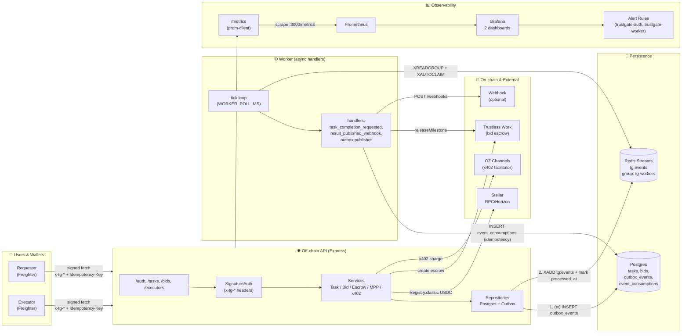
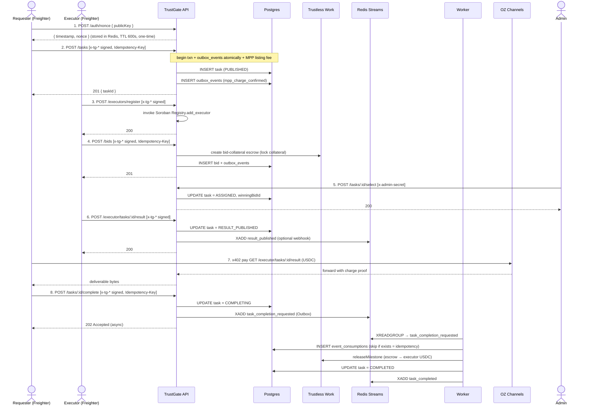
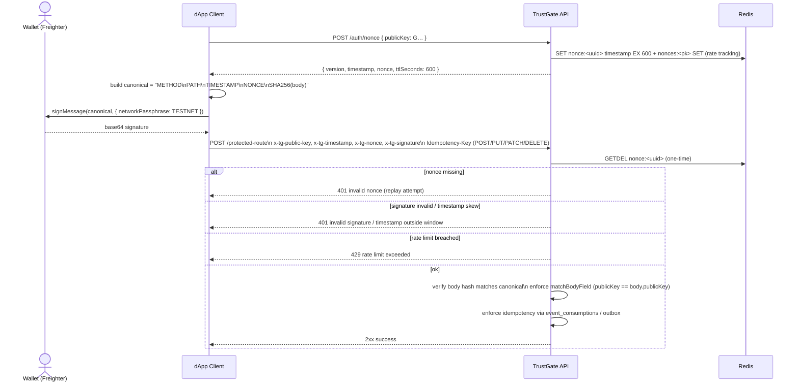

# TrustGate

**A trustless task marketplace on Stellar.** Requesters post tasks and escrow payment,
executors bid with collateral, the marketplace picks a winner, and Soroban + escrow
settle the deal automatically — no middleman holding funds.

Highlights:

- **On-chain executor registry** (Soroban `Registry` contract) — only allow-listed
  executors can win bids.
- **Bid-collateral escrow** via Trustless Work — executors post stake to deter fraud.
- **Pay-per-result access** (x402 + MPP) — requesters pay USDC only when fetching
  the actual deliverable.
- **Event-driven core** (Outbox pattern + Redis Streams + Worker) — all external
  side-effects run asynchronously with idempotent handlers.
- **Signed requests** (testnet/pubnet) — no secret keys over the wire; every
  state-mutating call is authenticated via `x-tg-*` headers and a server-issued
  one-time nonce.
- **Observability built-in** — Prometheus metrics (auth + worker + backlog),
  Grafana dashboards, alerting rules, P0/P1 runbooks, and a one-command
  [baseline verifier](#observability-baseline-verification) that regressions
  can't sneak past.

```text
requester ──list task, pay fee──▶  marketplace  ◀──register, bid + collateral── executor
                                        │
                                  select winner
                                        │
                          escrow releases on completion
```

## Table of contents

- [Stack](#stack)
- [Architecture](#architecture)
  - [System diagram](#system-diagram)
  - [Full lifecycle sequence](#full-lifecycle-sequence)
  - [Worker & Outbox pattern](#worker--outbox-pattern)
  - [Signed request flow](#signed-request-flow-on-testnetpubnet)
- [Quick start](#quick-start-local-network)
- [Environment variables](#environment-variables)
- [Testing](#testing)
- [Docker (full stack)](#docker-full-stack)
- [Running against real Stellar testnet](#running-against-real-stellar-testnet)
- [Signed requests (dApp)](#signed-requests-dapp)
- [API walkthrough](#example-full-lifecycle-via-curl)
- [Observability](#observability)
- [Architecture Decision Records](#architecture-decision-records)
- [Glossary](#glossary)
- [Known limitations](#known-limitations)

## Stack

| Layer | Choice |
|-------|--------|
| Runtime | Node.js 20+, TypeScript, Express |
| On-chain | Soroban `Registry` contract (executor allow-list), `@stellar/stellar-sdk` |
| Database | PostgreSQL (tasks / bids / outbox / event consumptions) |
| Queue / Streams | Redis 7+ (Redis Streams with consumer groups + XAUTOCLAIM) |
| Escrow | Trustless Work (bid collateral + milestone release) |
| Pay-per-result | x402 (`@x402/*`) + MPP (Stellar multi-path payments) |
| Auth (testnet/pubnet) | Ed25519 signed headers + server nonces (one-time, Redis 600s TTL) |
| Tests | Jest + Supertest (unit / integration / e2e) |
| Observability | pino (structured logs), prom-client (metrics), Prometheus, Grafana |
| API docs | swagger-jsdoc + swagger-ui-express → `GET /api-docs` |

## Architecture

TrustGate is split across three trust boundaries: (1) the **dApp / wallet**
running in the user's browser, (2) the **off-chain API + Worker** we operate,
and (3) **on-chain / external services** (Soroban RPC, Trustless Work, OZ
Channels). Data that requires consensus lives on-chain or in Trustless Work;
everything else lives in Postgres and is mirrored to Redis Streams for
asynchronous processing.

### System diagram

[[diagram: TrustGate arquitetura completa. Componentes: (1) Usuários: Requester Browser + Freighter wallet, Executor Browser + Freighter. (2) Off-chain API: Express rotas /auth /executors /tasks /bids /metrics. Camadas: SignatureAuth middleware, Controllers, Services (TaskService, BidService, EscrowService, MppChargeService, X402PaymentService, AuthController), Repositories (TaskRepository, BidRepository, OutboxRepository). (3) Persistência: Postgres (tabelas tasks, bids, outbox_events, event_consumptions, executors), Redis Streams (tg:events, consumer group tg-workers, XLEN/XPENDING). (4) Worker: tick loop a cada WORKER_POLL_MS, handlers por evento (task_completion_requested → releaseMilestone Trustless Work, webhook pós-resultado, outbox publisher). (5) Observabilidade: /metrics → Prometheus scrape → Grafana dashboards → alert rules, /health endpoints. (6) On-chain e externos: Stellar Soroban RPC + Horizon (Registry contract, USDC SAC), Trustless Work API (bid collateral + release), OZ Channels x402 facilitator, Webhook externo opcional. Setas: Requester/Executor -> signed fetch (x-tg-* headers + idempotency-key) -> API. API -> Postgres (transação outbox_events atômica). API -> Redis Streams (publisher marca processed_at). Worker -> XREADGROUP/XAUTOCLAIM -> handlers -> Trustless Work / Webhook / Postgres event_consumptions (idempotência). Prometheus -> scrape app:3000/metrics, Grafana -> Prometheus datasource + dashboards provisionados.]]



### Full lifecycle sequence



**Key guarantees in this flow:**

- Every write that crosses trust boundaries (escrow release, webhooks, listing
  fee) is **enqueued through the Outbox** before the HTTP transaction commits.
- The Worker delivers **at-least-once**; the `event_consumptions` table turns
  it into effectively **exactly-once per handler** by short-circuiting on
  duplicate `(handler_name, event_id)`.
- `POST /tasks/:id/complete` returns `202 Accepted` immediately instead of
  blocking on external escrow/network calls.

### Worker & Outbox pattern

See the full architectural justification in
[ADR 0001](file:///home/jistriane/TrustGate/TrustGate/docs/adr/0001-outbox-worker-idempotency.md).

**High level**:

1. The API writes an `outbox_events` row inside the same Postgres transaction
   as the state mutation it accompanies.
2. A publisher (either eager within the request or a dedicated cron) calls
   `XADD` on Redis Stream `tg:events` and sets `processed_at`.
3. The Worker runs a `setInterval` tick (default 2 s, non-overlapping via a
   `running` guard) that combines:
   - `XREADGROUP GROUP tg-workers <name> COUNT 32 STREAMS tg:events >` for new work.
   - `XAUTOCLAIM` every N ticks to recover entries from crashed consumers
     (stuck entries in `XPENDING` with idle time > threshold).
   - A backlog sampling path every 5 s that refreshes
     `tg_stream_length`, `tg_stream_pending`,
     `tg_stream_pending_consumer`, `tg_outbox_unprocessed`,
     `tg_outbox_failed` (see [Observability](#observability)).
4. Each handler wraps its work in: `SELECT 1 FROM event_consumptions WHERE
   handler = $1 AND event_id = $2` → if row exists, NOOP → else perform
   side-effects + `INSERT` consumption row.

Per-consumer pending cardinality is intentionally bounded by the consumer
group size (typically 1–16 workers), so the per-consumer label dimension in
`tg_stream_pending_consumer{stream,group,consumer}` is always low-cardinality
and safe to ship to Prometheus.

### Signed request flow (on testnet/pubnet)



Server rate limits: **10 failed auth attempts/min per public key**,
**30 failed/min per IP**. After the threshold, legitimate retries are 429 for
the remainder of the sliding window — see
[P1: Security / abuse](file:///home/jistriane/TrustGate/TrustGate/docs/observability.md#L375-L411)
runbook.

## Quick start (local network)

```bash
npm install
docker compose up -d          # Stellar Quickstart (standalone network) + Redis + Postgres
npm run deploy:registry       # deploys Registry contract, writes REGISTRY_CONTRACT_ID to .env
npm run start:dev             # http://localhost:3000
```

`deploy:registry` also generates and Friendbot-funds a throwaway
`ADMIN_SECRET` if you don't have one yet. Want explicit control instead? Copy
`.env.example` to `.env` and fill in values before running the steps above.

Once it's up:

| Endpoint | What it's for |
|----------|---------------|
| `GET /health` | Liveness check (`{ status: "ok" }`) |
| `GET /health/detailed` | Real Stellar RPC + Redis + Postgres connectivity check |
| `GET /metrics` | Prometheus metrics (text format) |
| `GET /api-docs` | Swagger UI — every endpoint documented and testable |
| `POST /auth/nonce` | Server-issued one-time nonce for signed requests |
| `POST /auth/signed-smoke` | Freighter / signed-request smoke test route |

## Environment variables

Full list with inline comments lives in [.env.example](file:///home/jistriane/TrustGate/TrustGate/.env.example);
a ready-made testnet config lives in [.env.testnet](file:///home/jistriane/TrustGate/TrustGate/.env.testnet)
(see [testnet section](#running-against-real-stellar-testnet)).

| Variable | Required | Default | Description |
|----------|----------|---------|-------------|
| **Network & runtime** | | | |
| `NETWORK` | | `local` | `local` (standalone Quickstart), `testnet`, or `pubnet`. |
| `TRUST_PROXY_HOPS` | | `0` | Number of trusted L7 proxies (CDN / load balancer / ingress nginx) directly in front of the app. `0` (default) = no proxy, trust only direct peer IP. Ex: `1` for Cloudflare alone, `2` for Cloudflare + Nginx. **Must be ≥ 1 in any production behind a proxy**, otherwise the signature-auth IP rate-limiter (10 failed sigs/min per public-key, 30/min per IP) can be bypassed by spoofing `X-Forwarded-For`; the structured request logger's `remoteAddress` will also be wrong. |
| `MOCK_EXTERNALS` | | `false` | Set `true` in local/dev to stub Trustless Work, x402, and webhooks so the full lifecycle works without real credentials. |
| `TG_ALLOW_CLIENT_NONCE` | | `false` | **Danger** — allows clients to self-generate nonces. Use only as a P0 workaround when Redis is unhealthy; see runbook. |
| `NODE_ENV` | | — | `development`, `test`, or `production` (affects pino level, error response detail). |
| **Stellar / RPC** | | | |
| `STELLAR_RPC_URL` | | Quickstart local | Soroban RPC endpoint. |
| `STELLAR_HORIZON_URL` | | Quickstart local | Horizon endpoint. |
| `ADMIN_SECRET` | | auto on `local` | Marketplace admin's Stellar secret key (`S…`). Auto-generated + Friendbot-funded on `local` if unset. |
| `MARKETPLACE_WALLET` | | `ADMIN_SECRET` pub | Public key that receives listing fees. |
| `USDC_ISSUER` | ✅ | — | Classic USDC asset issuer (`G…`). The app derives the SAC contract ID from this + `NETWORK`. |
| `REGISTRY_CONTRACT_ID` | ✅ | — | Set by `npm run deploy:registry`. |
| **Persistence** | | | |
| `DATABASE_URL` | ✅ | | Postgres connection string (tasks, bids, outbox, event consumptions, etc.). |
| `REDIS_URL` | ✅ | | Redis 7+ URL. Used for: nonces, streams, rate limits, backlog sampling. |
| **Worker / Outbox** | | | |
| `WORKER_ENABLED` | | `true` | Set `false` to disable the in-process Worker (useful when scaling the worker out-of-process). |
| `OUTBOX_STREAM_KEY` | | `tg:events` | Redis Stream key name. |
| `OUTBOX_CONSUMER_GROUP` | | `tg-workers` | Consumer group name for XREADGROUP / XAUTOCLAIM. |
| `OUTBOX_CONSUMER_NAME` | | `hostname:pid` | Unique consumer name within the group. Autodetect if empty. |
| `WORKER_POLL_MS` | | `2000` | Interval between worker ticks. Must be ≥ handler worst-case latency to avoid backpressure. |
| `WORKER_MAX_ATTEMPTS` | | `10` | Max retries per event via `due_retries`; above threshold, event moves to dead-letter (manual triage). |
| **MPP / listing fees** | | | |
| `MPP_SECRET_KEY` | ✅ on testnet/pubnet | | HMAC ≥ 32 bytes. Binds `POST /tasks` charge challenges to their contents. Unused on `local`. |
| **Escrow (Trustless Work)** | | | |
| `TRUSTLESS_WORK_API_KEY` | ✅ (unless `MOCK_EXTERNALS`) | | API key for bid-collateral escrow + milestone releases. |
| **Pay-per-result (x402 / OZ Channels)** | | | |
| `OZ_API_KEY` | (required for result route) | | OZ Channels key. Without it, `GET /executor/tasks/:id/result` isn't mounted — rest of the app still runs. |
| `X402_NETWORK` | | `stellar:testnet` | CAIP-2 network id passed to x402. |
| `X402_FACILITATOR_URL` | | OZ testnet | OZ Channels facilitator base URL. |
| `EXECUTOR_WALLET` | | marketplace wallet | Stellar public key that receives x402 result payments. |
| `EXECUTOR_RESULT_PRICE` | | `$0.05` | Price (USDC) for `GET /executor/tasks/:id/result`. Supports `$0.05` format or raw stroops. |
| **Webhooks** | | | |
| `WEBHOOK_TIMEOUT_MS` | | `5000` | Hard timeout (AbortController) per HTTP attempt for outbound webhook calls. Inner wrapper retries up to `WEBHOOK_MAX_RETRIES` times and outer worker-level `WORKER_MAX_ATTEMPTS` (default 10) retries further via XAUTOCLAIM. |
| `WEBHOOK_MAX_RETRIES` | | `3` | Number of retries inside a single worker tick postJson call (>= 0, integer). Default `3` = up to 4 total HTTP attempts per event (1 + 3 retries). Qualifying retryable errors: 5xx, 429, 408, network throw (ECONNRESET/DNS/ETIMEDOUT/AbortError). Non-retryable (fail-fast): 400/401/403/404/410. 429/503 `Retry-After: N` integer header overrides the computed backoff when longer. |
| `WEBHOOK_BASE_BACKOFF_MS` | | `1000` | Base backoff (ms, >= 50) for the first retry; subsequent retries double exponentially ±50% "Full Jitter" AWS pattern (1s → ~0.5–1.5s → ~1–3s → ~2–6s for default 3 retries). |
| `RESULT_PUBLISHED_WEBHOOK_URL` | | — | Optional URL called with POST JSON when an executor publishes a result. |
| **Smart accounts (scripts only)** | | | |
| `ACCOUNT_WASM_HASH` | (scripts only) | | WASM hash of a deployed OpenZeppelin smart account (see [Known limitations](#known-limitations)). |
| `REQUESTER_SECRET` | (scripts only) | | Requester key used by `deploy-smart-account.ts`. |
| `SMART_ACCOUNT_CONTRACT_ID` | (scripts only) | | Set by the smart-account deploy script. |
| `SPENDING_LIMIT_POLICY_ADDRESS` | (scripts only) | | Spending-limit policy contract WASM address. |

### Webhook receiver (local)

For quick local testing, run a simple webhook receiver:

```bash
npm run webhook:receiver
```

Then point the app to it (for `start:dev` outside Docker):

```bash
RESULT_PUBLISHED_WEBHOOK_URL=http://localhost:4000/webhooks/result-published npm run start:dev
```

## Testing

```bash
npm test              # unit + integration (skips anything needing real external credentials)
npm run test:e2e      # full mocked lifecycle: register → publish → bid → select → pay → release
```

Tests that need real infrastructure (a live local Stellar Quickstart, a real
Trustless Work key, a real OZ Channels key) are gated with `describe.skip`
and skip cleanly when that infrastructure isn't present — they aren't flaky,
they're honest about what they need.

## Docker (full stack)

```bash
docker compose -f docker-compose.yml -f docker-compose.observability.yml up --build -d
curl http://localhost:3000/health
```

Open:

- App + API docs: <http://localhost:3000/api-docs>
- Prometheus targets: <http://localhost:9090/targets>
- Grafana dashboards (anonymous Viewer): <http://localhost:3001/dashboards>

The `app` service waits for Stellar, Postgres, and Redis to be reachable
(`scripts/wait-for-it.sh`) before starting, reads secrets from `.env.docker`
via `env_file`, and overrides network-specific URLs to point at the
in-Compose-network hostnames.

## Running against real Stellar testnet

```bash
npm run testnet:setup            # generates + Friendbot-funds admin/requester/executor accounts,
                                  # adds real Circle USDC trustlines, writes .env.testnet
npm run testnet:deploy-registry  # deploys the Registry contract to testnet
```

The one step that can't be scripted: fund the requester with real (fictitious)
testnet USDC via the [Circle faucet](https://faucet.circle.com) — it's a
captcha-gated web form. The setup script prints the exact address to paste in.

For signed-request validation against the real stack, run
`scripts/validate-signed-requests.ts` (uses `NETWORK=testnet` env) or the
observability baseline's built-in [signed smoke](#observability-baseline-verification)
check.

## Signed requests (dApp)

On testnet/pubnet, endpoints that mutate state never accept secret keys
(`S…`). Instead, the caller proves ownership of a Stellar account by signing
a canonical payload and sending it in request headers.

This project recommends server-issued one-time nonces via `POST /auth/nonce`
and signing via Stellar Wallets Kit. The full sequence diagram is in
[Signed request flow](#signed-request-flow-on-testnetpubnet).

**Canonical body-hashing guarantee (P1.2):** the built-in `express.json()`
middleware preserves the exact raw bytes received on the wire via its
`verify` callback (see `src/app.ts`) and stores them in `(req as any).rawBody`
**before** `JSON.parse` runs. `signatureAuth.ts` computes the SHA-256 body
hash from that raw Buffer first, only falling back to `JSON.stringify(req.body)`
when no raw buffer exists (e.g. custom body parsers — a setup that should be
avoided on routes requiring signed requests). On the client side, this means
**you MUST send the exact same bytes you signed** — if you call
`JSON.stringify(body)` locally, use it for both the signature payload AND the
HTTP request body verbatim (same whitespace, same field ordering, no `replacer`
that differs between signature and request submission). Clients using
`@stellar/stellar-sdk` via the canonical signing helper in
`scripts/validate-signed-requests.ts` do this correctly out of the box.

### Install (React/Next.js)

```bash
npm i @creit.tech/stellar-wallets-kit @stellar/stellar-sdk
```

### Snippet

```ts
import { StellarWalletsKit, WalletNetwork, allowAllModules, FREIGHTER_ID } from '@creit.tech/stellar-wallets-kit';
import { Networks } from '@stellar/stellar-sdk';

const API_BASE_URL = 'http://localhost:3000';

const kit = new StellarWalletsKit({
  network: WalletNetwork.TESTNET,
  selectedWalletId: FREIGHTER_ID,
  modules: allowAllModules(),
});

async function sha256Hex(text: string): Promise<string> {
  const bytes = new TextEncoder().encode(text);
  const digest = await crypto.subtle.digest('SHA-256', bytes);
  return [...new Uint8Array(digest)].map((b) => b.toString(16).padStart(2, '0')).join('');
}

async function tgSignedFetch<TResponse>(
  method: 'GET' | 'POST' | 'PUT' | 'PATCH' | 'DELETE',
  path: string,
  body: unknown,
  options: { idempotencyKey?: string } = {},
): Promise<TResponse> {
  const { address: publicKey } = await kit.getAddress();

  const nonceRes = await fetch(`${API_BASE_URL}/auth/nonce`, {
    method: 'POST',
    headers: { 'Content-Type': 'application/json' },
    body: JSON.stringify({ publicKey }),
  });
  if (!nonceRes.ok) {
    throw new Error(`nonce failed: ${nonceRes.status}`);
  }
  const { timestamp, nonce } = (await nonceRes.json()) as { timestamp: number; nonce: string };

  const bodyText = JSON.stringify(body ?? {});
  const bodyHash = await sha256Hex(bodyText);

  const canonical = `${method}\n${path}\n${String(timestamp)}\n${nonce}\n${bodyHash}`;
  const { signedMessage } = await kit.signMessage(canonical, {
    address: publicKey,
    networkPassphrase: Networks.TESTNET,
  });

  const headers: Record<string, string> = {
    'Content-Type': 'application/json',
    'x-tg-public-key': publicKey,
    'x-tg-timestamp': String(timestamp),
    'x-tg-nonce': nonce,
    'x-tg-signature': signedMessage,
  };
  if (options.idempotencyKey) {
    headers['Idempotency-Key'] = options.idempotencyKey;
  }

  const res = await fetch(`${API_BASE_URL}${path}`, {
    method,
    headers,
    body: method === 'GET' ? undefined : bodyText,
  });
  if (!res.ok) {
    throw new Error(`request failed: ${res.status} ${await res.text()}`);
  }
  return (await res.json()) as TResponse;
}

async function exampleRegisterExecutor(): Promise<void> {
  await tgSignedFetch('POST', '/executors/register', { publicKey: 'G...', metadataUri: 'https://example.com/meta.json' }, {
    idempotencyKey: crypto.randomUUID(),
  });
}
```

Notes:

- The signed `path` must match the server route exactly and **exclude query strings**
  (for example, `/tasks/123/complete`).
- For endpoints that mutate state, `Idempotency-Key` is **required**.
- The request body hash is computed from the exact JSON string sent over the
  wire. Always use the same `bodyText` for hashing and `fetch`.
- If you want users to pick another wallet, initialize the kit with a
  different `*_ID` or use the kit's built-in modal and call `kit.setWallet(...)`
  before `getAddress()`.

### Freighter smoke test (local/Docker)

To validate Freighter signing against a running local stack, use the built-in
smoke route `POST /auth/signed-smoke`. It also runs automatically as part of
the [baseline verifier](#observability-baseline-verification).

Freighter quick checklist:

- Install the Freighter browser extension and create/import an account.
- Ensure Freighter is unlocked and the expected account is active.
- Allow the dApp's origin in Freighter (connect the site when prompted).
- If the kit's modal/button is used, confirm you selected Freighter and not
  another wallet.
- If you run the API via Docker, your dApp must call the host URL (for
  example `http://localhost:3000`), not the in-compose hostname.

1) Start Docker (local network + observability recommended):

```bash
docker compose -f docker-compose.yml -f docker-compose.observability.yml up --build -d
```

2) From your React app (Freighter via Stellar Wallets Kit), call:

- `POST /auth/nonce` to get `{ timestamp, nonce }`
- `POST /auth/signed-smoke` with the signature headers and a body like
  `{ publicKey: "...", hello: "world" }`

Copy/paste example (TypeScript):

```ts
import { StellarWalletsKit, WalletNetwork, allowAllModules, FREIGHTER_ID } from '@creit.tech/stellar-wallets-kit';
import { Networks } from '@stellar/stellar-sdk';

const API_BASE_URL = 'http://localhost:3000';

const kit = new StellarWalletsKit({
  network: WalletNetwork.TESTNET,
  selectedWalletId: FREIGHTER_ID,
  modules: allowAllModules(),
});

async function sha256Hex(text: string): Promise<string> {
  const bytes = new TextEncoder().encode(text);
  const digest = await crypto.subtle.digest('SHA-256', bytes);
  return [...new Uint8Array(digest)].map((b) => b.toString(16).padStart(2, '0')).join('');
}

export async function validateSignedSmoke(): Promise<void> {
  const { address: publicKey } = await kit.getAddress();

  const nonceRes = await fetch(`${API_BASE_URL}/auth/nonce`, {
    method: 'POST',
    headers: { 'Content-Type': 'application/json' },
    body: JSON.stringify({ publicKey }),
  });
  if (!nonceRes.ok) throw new Error(`nonce failed: ${nonceRes.status} ${await nonceRes.text()}`);
  const { timestamp, nonce } = (await nonceRes.json()) as { timestamp: number; nonce: string };

  const body = { publicKey, hello: 'world' };
  const bodyText = JSON.stringify(body);
  const bodyHash = await sha256Hex(bodyText);

  const canonical = `POST\n/auth/signed-smoke\n${String(timestamp)}\n${nonce}\n${bodyHash}`;
  const { signedMessage } = await kit.signMessage(canonical, {
    address: publicKey,
    networkPassphrase: Networks.TESTNET,
  });

  const res = await fetch(`${API_BASE_URL}/auth/signed-smoke`, {
    method: 'POST',
    headers: {
      'Content-Type': 'application/json',
      'x-tg-public-key': publicKey,
      'x-tg-timestamp': String(timestamp),
      'x-tg-nonce': nonce,
      'x-tg-signature': signedMessage,
    },
    body: bodyText,
  });

  const text = await res.text();
  if (!res.ok) throw new Error(`smoke failed: ${res.status} ${text}`);
  console.log('smoke ok:', text);
}
```

Expected response:

```json
{ "ok": true, "publicKey": "G..." }
```

### Troubleshooting (Freighter / signed requests)

- **401 `missing signature headers`**: ensure you are sending all headers:
  `x-tg-public-key`, `x-tg-timestamp`, `x-tg-nonce`, `x-tg-signature`.
- **401 `timestamp outside allowed window`**: call `POST /auth/nonce`
  **immediately before** the signed request and reuse the returned
  `timestamp`. Server nonces carry their own issue timestamp and reject
  client-clock drift.
- **401 `invalid nonce`**: server nonces are one-time (consumed with
  `GETDEL`). Never reuse the same `{ nonce, timestamp }` for a second
  request; always fetch a fresh nonce.
- **401 `public key mismatch for <field>`**: the body field (e.g.
  `publicKey` / `executorPublicKey`) must equal `x-tg-public-key`.
- **401 `invalid signature`**: confirm the canonical string is **exactly**:
  - `${METHOD}\n${PATH}\n${TIMESTAMP}\n${NONCE}\n${SHA256_HEX(bodyText)}`
  - `PATH` must exclude query string and match the route exactly (e.g.
    `/auth/signed-smoke`).
  - `bodyText` must be the exact JSON string you send in `fetch` (same
    spacing/order). Use the same variable.
- **429 `rate limit exceeded`**: too many failed auth attempts (IP/public
  key). Wait a minute and retry, or fix the canonical/payload first.
- **CORS / preflight issues**: ensure the browser can send custom headers.
  If you deploy behind a proxy, verify CORS allows `x-tg-*` headers.

## Example: full lifecycle via curl

The sequence diagram in [Full lifecycle sequence](#full-lifecycle-sequence)
maps to these concrete calls. On `NETWORK=local` you can use the secret-key
shortcuts below (accepted because no signed-auth middleware is mounted for
`local`); on `testnet`/`pubnet` wrap each state-mutating call with the
[tgSignedFetch helper](#snippet) above (or equivalent `x-tg-*` headers).

```bash
# 1. Register an executor
curl -X POST localhost:3000/executors/register \
  -H 'Content-Type: application/json' \
  -d '{"secret":"S...(executor)","metadataUri":"https://executor.example.com/meta.json"}'

# 2. Requester publishes a task (pays a 0.5% USDC listing fee via MPP)
curl -X POST localhost:3000/tasks \
  -H 'Content-Type: application/json' \
  -d '{"requester":"G...","secret":"S...(requester)","reservePrice":"10","description":"Summarize this PDF","deadline":"2026-12-31T00:00:00.000Z"}'

# 3. Executor bids, locking collateral in Trustless Work escrow
curl -X POST localhost:3000/bids \
  -H 'Content-Type: application/json' \
  -d '{"taskId":"<id>","executor":"G...","secret":"S...(executor)","amount":"9","collateral":"1"}'

# 4. Admin selects the winning bid
curl -X POST localhost:3000/tasks/<id>/select -H 'x-admin-secret: <ADMIN_SECRET>'

# 5. Requester pays the executor's result endpoint via x402 (see src/services/x402PaymentService.ts)

# 6. Requester marks the task complete — returns 202 Accepted, escrow releases async via Worker
curl -X POST localhost:3000/tasks/<id>/complete \
  -H 'Content-Type: application/json' \
  -H 'Idempotency-Key: <uuid>' \
  -d '{"requester":"G...","secret":"S...(requester)"}'
```

Every request/response shape is documented interactively at `GET /api-docs`.

## Observability

- **Runbooks, SLOs, thresholds, P0/P1 triage** — all live in
  [docs/observability.md](file:///home/jistriane/TrustGate/TrustGate/docs/observability.md).
- **Metric catalogs**
  ([auth](file:///home/jistriane/TrustGate/TrustGate/src/config/authMetrics.ts),
  [worker+backlog](file:///home/jistriane/TrustGate/TrustGate/src/config/workerMetrics.ts))
  are the source of truth for label names and PromQL used in dashboards and
  alerts.
- **Alert rules** — [prom/alerts/trustgate-alerts.yml](file:///home/jistriane/TrustGate/TrustGate/prom/alerts/trustgate-alerts.yml)
  (two groups: `trustgate-auth`, `trustgate-worker`).
- **Grafana dashboards** — provisioned from
  [grafana/dashboards/](file:///home/jistriane/TrustGate/TrustGate/grafana/dashboards/):
  `trustgate-auth-overview.json`, `trustgate-worker-overview.json`.
- **Local observability stack** — `docker-compose.observability.yml`
  provisions Prometheus + scrape configs + rules and Grafana (anonymous
  Viewer, file-based dashboards).

## Observability baseline verification

A single script validates that the whole observability surface (Prometheus
rules, Grafana dashboards, signed request smoke, and required metrics) works
end-to-end **before** you consider a deploy healthy. It exists so regressions
in alerts, dashboards, or the signed-request middleware are caught locally
instead of in production.

### What it does

`scripts/observability-baseline.sh` runs 6 phases with `set -euo pipefail`
(any non-zero step aborts the whole run with a clear message):

1. **Preflight parse** — validates `prom/alerts/trustgate-alerts.yml`
   (groups/rules/expr with a minimal inline YAML parser — no extra deps)
   and every `grafana/dashboards/*.json` (title required, every panel with
   `targets` in timeseries/graph/stat/gauge/table panels needs an `expr`
   field).
2. **Stack up** — runs
   `docker compose -f docker-compose.yml -f docker-compose.observability.yml up --build -d`
   with an isolated `COMPOSE_PROJECT_NAME=trustgate-baseline-<random>` so
   concurrent runs never clash.
3. **Health wait** — polls `/health` (app), `/-/ready` (Prometheus) and
   `/api/health` (Grafana) up to 120×2 s each.
4. **TypeScript checks** —
   `npx ts-node --transpile-only scripts/observability-baseline-checks.ts`
   executes:
   - `runSignedSmoke` — `Keypair.random()` → `POST /auth/nonce` →
     canonical string sign → `POST /auth/signed-smoke` → expects
     `{ ok: true }`.
   - `runMetricsSanity` — `GET /metrics` must contain all of
     `tg_auth_nonce_requests_total`, `tg_worker_tick_total`,
     `tg_outbox_unprocessed`, `tg_stream_pending`,
     `tg_stream_pending_consumer`.
   - `runPromSanity` — `/api/v1/targets` needs a healthy `trustgate-app`
     job; `/api/v1/rules` needs groups `trustgate-auth` /
     `trustgate-worker`.
   - `runGrafanaSanity` — `/api/health` reports `database: ok`.
5. **Curl sanity** — `GET /api/v1/rules` must be `status: success` and
   include at least one trustgate group.
6. **Cleanup trap** — `trap cleanup EXIT ERR INT TERM` always tears the
   project down with `down -v --remove-orphans`. Pass `--keep` to skip
   cleanup and inspect the stack manually.

### How to run

```bash
# Full baseline — fails hard on any step.
bash scripts/observability-baseline.sh

# Keep the compose stack alive after success, for manual exploration:
bash scripts/observability-baseline.sh --keep
```

### Optional: signed-request + metrics self-test (no full Docker stack)

If you only want to validate the signed-request middleware and the required
metrics payload without starting the full compose stack, use
`scripts/baseline-selftest.ts`. It starts a minimal in-process Express app
with `AuthController` + a `/metrics` stub and runs the same smoke/metrics
checks against a throwaway Redis container bound to a random host port.
Requires `docker` available locally (for the Redis container only).

```bash
npx ts-node --transpile-only scripts/baseline-selftest.ts
# -> { "ok": true }
```

## Architecture Decision Records

Design choices that are non-obvious or easy to second-guess are captured as
ADRs under [docs/adr/](file:///home/jistriane/TrustGate/TrustGate/docs/adr/).
When proposing a change to one of these systems, open a new ADR and reference
it in your PR description.

| ID | Title | Status |
|----|-------|--------|
| 0001 | [Outbox + Worker idempotente (Redis Streams) e conclusão assíncrona com Trustless Work](file:///home/jistriane/TrustGate/TrustGate/docs/adr/0001-outbox-worker-idempotency.md) | ✅ Accepted 2026-08-04 |
| 0002 | [Estratégia on-chain: Registry Soroban Immutable + Escrow via SaaS Trustless Work](file:///home/jistriane/TrustGate/TrustGate/docs/adr/0002-on-chain-strategy-registry-immutable-escrow-saas.md) | ✅ Accepted 2026-08-05 |

To add a new ADR, copy `0001-*.md` as `0003-*.md`, fill in the
`Contexto / Decisão / Consequências / Alternativas consideradas` sections,
and reference it from this table.

## Glossary

| Term | Meaning in TrustGate |
|------|----------------------|
| **Nonce** | Server-issued UUID, stored in Redis with 600 s TTL, consumed with `GETDEL` (one-time). Guards against replay attacks. |
| **Canonical string** | `METHOD\nPATH\nTIMESTAMP\nNONCE\nSHA256_HEX(bodyText)` — exact bytes signed by the wallet. |
| **Outbox** | Postgres table `outbox_events`, written in the same txn as business state. Guarantees "event published if and only if state changed." |
| **Redis Streams / PEL** | Pending Entries List: entries delivered to a consumer in a consumer group but not yet `XACK`ed. `XPENDING` + `XAUTOCLAIM` detect and recover crashed consumers. |
| **`event_consumptions`** | Postgres table with unique key `(handler_name, event_id)`. Turns at-least-once worker delivery into effectively exactly-once per handler. |
| **SAC** | Stellar Asset Contract — the CW20-like Soroban contract ID derived automatically from a classic asset's `{ issuer, code }`. Used for USDC here. |
| **MPP** | Multi-Path Payments — the mechanism the marketplace uses to charge listing fees in USDC atomically; challenge-then-settle with `MPP_SECRET_KEY` on testnet/pubnet. |
| **x402** | HTTP 402 Payment Required standard — OZ Channels mediate the micro-USDC charge for `GET /executor/tasks/:id/result`. |
| **Stroop** | Smallest unit of a Stellar asset (1 USDC = 10,000,000 stroops). All on-wire `BIGINT` amounts in Postgres/Redis are stroops. |
| **Registry** | Soroban contract that acts as the allow-list of eligible executors; only addresses added here can win bids. |

## Known limitations

A few integrations depend on external services we can't fully provision in an
automated environment. Each is wired with real, working client code — the
limitation is credentials, not implementation:

- **Trustless Work** (`EscrowService`) needs a real account/API key from
  [trustlesswork.com](https://blocks.trustlesswork.com). Use `MOCK_EXTERNALS=true`
  in local/dev to exercise the lifecycle without one.
- **OZ Channels** (x402 facilitator) needs a real key from
  [channels.openzeppelin.com](https://channels.openzeppelin.com/testnet/gen).
  Without it, the x402-gated result endpoint is simply not mounted.
- **OpenZeppelin smart accounts** (`scripts/deploy-smart-account.ts`) need an
  already-deployed contract WASM — none ships in any published npm package
  for this feature, so `ACCOUNT_WASM_HASH` must come from building
  [github.com/kalepail/smart-account-kit](https://github.com/kalepail/smart-account-kit)'s
  Rust contract yourself.
- **Circle testnet USDC** requires the captcha-gated
  [faucet](https://faucet.circle.com) — see the
  [testnet section](#running-against-real-stellar-testnet).
