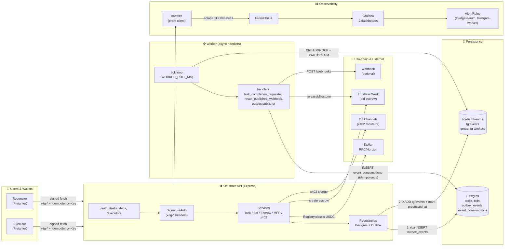

# Architecture deep dive

This page holds the full-detail version of the system diagram for readers who
want every component and data path. The [README](../README.md#architecture)
keeps a simplified version aimed at newcomers — start there first.

## Full component diagram

[[diagram: Complete TrustGate architecture. Components: (1) Users: Requester Browser + Freighter wallet, Executor Browser + Freighter. (2) Off-chain API: Express routes /auth /executors /tasks /bids /metrics. Layers: SignatureAuth middleware, Controllers, Services (TaskService, BidService, EscrowService, MppChargeService, X402PaymentService, AuthController), Repositories (TaskRepository, BidRepository, OutboxRepository). (3) Persistence: Postgres (tables tasks, bids, outbox_events, event_consumptions, executors), Redis Streams (tg:events, consumer group tg-workers, XLEN/XPENDING). (4) Worker: tick loop every WORKER_POLL_MS, per-event handlers (task_completion_requested → releaseMilestone Trustless Work, post-result webhook, outbox publisher). (5) Observability: /metrics → Prometheus scrape → Grafana dashboards → alert rules, /health endpoints. (6) On-chain and external: Stellar Soroban RPC + Horizon (Registry contract, USDC SAC), Trustless Work API (bid collateral + release), OZ Channels x402 facilitator, optional external webhook. Arrows: Requester/Executor -> signed fetch (x-tg-* headers + idempotency-key) -> API. API -> Postgres (atomic outbox_events transaction). API -> Redis Streams (publisher marks processed_at). Worker -> XREADGROUP/XAUTOCLAIM -> handlers -> Trustless Work / Webhook / Postgres event_consumptions (idempotency). Prometheus -> scrape app:3000/metrics, Grafana -> Prometheus datasource + provisioned dashboards.]]

## Trust boundaries

TrustGate is split across three trust boundaries:

1. The **dApp / wallet** running in the user's browser.
2. The **off-chain API + Worker** we operate.
3. **On-chain / external services** (Soroban RPC, Trustless Work, OZ Channels).

Data that requires consensus lives on-chain or in Trustless Work; everything
else lives in Postgres and is mirrored to Redis Streams for asynchronous
processing.

## Worker & Outbox pattern (full detail)

See the full architectural justification in
[ADR 0001](adr/0001-outbox-worker-idempotency.md).

1. The API writes an `outbox_events` row inside the same Postgres transaction
   as the state mutation it accompanies.
2. A publisher (either eager within the request or a dedicated cron) calls
   `XADD` on Redis Stream `tg:events` and sets `processed_at`.
3. The Worker runs a `setInterval` tick (default 2s, non-overlapping via a
   `running` guard) that combines:
   - `XREADGROUP GROUP tg-workers <name> COUNT 32 STREAMS tg:events >` for new work.
   - `XAUTOCLAIM` every N ticks to recover entries from crashed consumers
     (stuck entries in `XPENDING` with idle time > threshold).
   - A backlog sampling path every 5s that refreshes
     `tg_stream_length`, `tg_stream_pending`,
     `tg_stream_pending_consumer`, `tg_outbox_unprocessed`,
     `tg_outbox_failed` (see [Observability](../README.md#observability)).
4. Each handler wraps its work in: `SELECT 1 FROM event_consumptions WHERE
   handler = $1 AND event_id = $2` → if row exists, NOOP → else perform
   side-effects + `INSERT` consumption row.

Per-consumer pending cardinality is intentionally bounded by the consumer
group size (typically 1-16 workers), so the per-consumer label dimension in
`tg_stream_pending_consumer{stream,group,consumer}` is always low-cardinality
and safe to ship to Prometheus.
